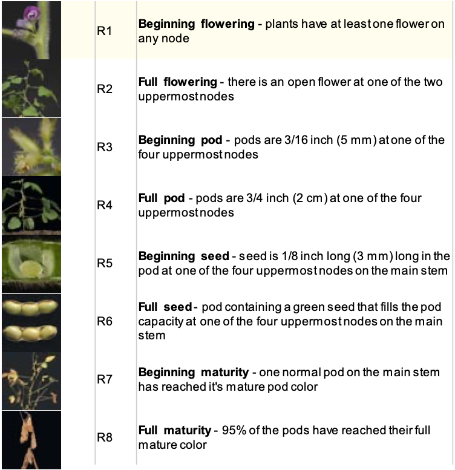

# summer_21

Identifying effects of certain gene mutations in Soybeans to maximimize oil production. Genes are as follows:
- WR1
- DGAT
- KASII

3 stages of growth that data is pullled from:
- R5
- R5/6
- R6

All growth stages are mentioned below for reference:

 
 

4 types of plants that the experiment is conducted on:
- Wild type (WT= short for 'wild type')
- pPTN1174 (WR1)
- pPTN1248 (WR1 + DGAT)
- pPTN1314 (WR1 + KASII)

The plants are identified in the following way:
- The letters A, B, & C represent a plant in R5, R5/6, & R6
- The numbers 1, 2, 3, & 4 represent a WT, WR1, WR1 + DGAT, & WR1 + KASII plants

The table below shows a representation of the plants w/o the replicates.
| Plant types | 1 | 2 | 3 | 4 |
| ----------- | - | - | - | - |
| **A** | WT @ R5 | WR1 @ R5 | WR1 + DGAT @ R5 | WR1 + KASII @ R5 |
| **B** | WT @ R5/6 | WR1 @ R5/6 | WR1 + DGAT @ R5/6 | WR1 + KASII @ R5/6 |
| **C** | WT @ R6 | WR1 @ R6 | WR1 + DGAT @ R6 | WR1 + KASII @ R6 |

Each of these plants have 3 replicas such that A1 has 3 subplants those being- A1_1, A1_2, & A1_3. Therefore, in total, there are 36 different plants that the data was accquired from.

Key- https://docs.google.com/document/d/1vGaXJt5MUhUD90yCil-DNpFd2RF72Sdmxx-b_gUNvyI/edit?usp=sharing
